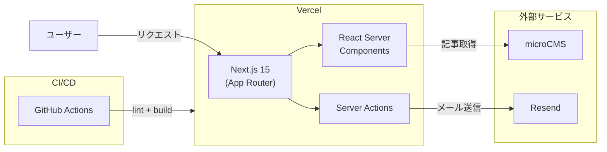
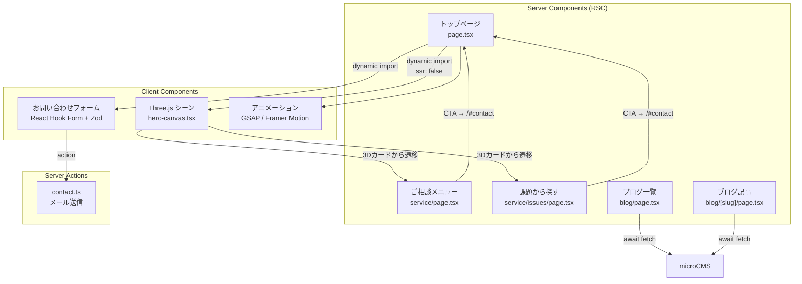

# TANEBI CREATIVE

> 個人事業 TANEBI CREATIVE のコーポレートサイト（[tanebi-net.com](https://tanebi-net.com)）

## はじめに

このリポジトリは、ポートフォリオとしても公開しています。 企画・デザイン・実装・運用を担当しています。

https://github.com/user-attachments/assets/9b5a6d05-6d35-423d-b108-a62fcf70b035

## 課題と解決

| 課題 | 解決したこと |
|---|---|
| 技術力や事業内容を伝える場所がなく、クライアントへの窓口もありませんでした | インタラクティブな 3D サイトで技術力を体験として伝え、実際にお問い合わせ獲得にもつながりました |
| 知見の発信・SEO による継続的な集客ができていませんでした | ブログ機能を実装し、記事ベースの発信・検索流入の基盤を構築しました |
| 「何を頼めるのか」が伝わらず、相談前に離脱されていました | サービス紹介ページを追加し、困りごとから相談メニューへ辿れる導線を用意しました |
| 演出が重く、一般的な回線・端末では表示に 20 秒かかっていました | 実測にもとづく最適化で LCP 20.2 秒 → 4.5 秒、総転送量 3.99MB → 1.79MB に改善しました |

---

## デザインコンセプト

<details>
<summary>詳細を見る</summary>

### ブランドの世界観

TANEBI（種火）という社名には、暗闇の中にある小さな火——希望の始まり——という意味が込められています。サイト全体のビジュアルテーマはこの世界観から設計しました。

漆黒の宇宙空間は、クライアントが抱えるさまざまな課題や不確かさを表しています。その中心に輝く三角形が TANEBI CREATIVE であり、「伴走しながら課題解決へ向かう」存在を象徴しています。

### ファーストビューに 3D を選んだ理由

クリエイティブ企業として、**最初の数秒で技術力と世界観を同時に伝える**ことを優先しました。テキストや静止画では「説明」にとどまりますが、インタラクティブな 3D 空間は「体験」として記憶に残ります。スクロールに連動して変化するシーンは、サイトを最後まで読み進める動機づけにもなっています。

### 三角形のシンボリズム

三角形は、創業者がルーツの一つとするアフロブラジル音楽・文化における「3」という概念から着想を得ています。三という数字は多くの伝統文化において「バランス・調和・完成」を意味し、このサイトでもクライアント・課題・解決策という三者の関係性を三角形で表現しています。

三角形はあえて**2層構造**にしています：

- **内側（塗りつぶし）**: 中心となる課題に正面から向き合い、伴走する TANEBI CREATIVE の姿
- **外側（ワイヤーフレーム）**: 枠の中に閉じこもらず、常に外へと開拓・拡張していく姿勢

三角形はゆっくりと自転しながら色が変化します。色が固定されていないのは、「解決策は一つではなく、クライアントの状況に応じて柔軟に変わる」ことを表しています。多色展開はクライアントの業種・課題・状況の多様さそのものです。

### 星空と宇宙飛行士

無数の星は「数多ある選択肢や解決の可能性」を表しています。その宇宙空間を漂う宇宙飛行士がクライアントです。広大で不確かな空間の中で、最適な答えを一緒に見つけていく——そのパートナーシップがこのサイトのビジュアルに込めた物語です。

### フォント

トップページはシステムフォント（Arial / sans-serif）を基本とし、Web フォントの読み込みを排除することでファーストビューの表示速度を優先しています。3D シーンの初期ロードが重いサイト特性を踏まえ、フォント起因のレンダリングブロックをゼロにする設計としました。

下層のサービス紹介ページ（`/service`, `/service/issues`）は 3D シーンを持たず、読み物としての可読性を優先するため、`next/font/google` で Anton（英字ディスプレイ）と Noto Sans JP（本文・和文見出し）を読み込んでいます。適用範囲は LP のコンテナに限定し、トップページには影響させていません。

</details>

---

## 技術スタック

[](https://skillicons.dev)

| カテゴリ | 技術 |
|---|---|
| フレームワーク | Next.js 15 (App Router) / React 19 / TypeScript 5 |
| 3Dグラフィックス | Three.js / React Three Fiber / カスタムGLSLシェーダー (16本) |
| スタイリング | Tailwind CSS / shadcn/ui (Radix UI) |
| アニメーション | GSAP / Framer Motion |
| バックエンド | Server Actions |
| CMS | microCMS |
| メール送信 | Resend |
| バリデーション | Zod / React Hook Form |
| コード品質 | Biome (Linter + Formatter) |
| AI開発 | Claude Code (カスタムスキル / CLAUDE.md 開発憲章) |
| CI/CD | GitHub Actions → Vercel |
| SEO（AIO/LLMO） | JSON-LD 構造化データ / llms.txt / 動的サイトマップ |
| セキュリティ | sanitize-html (XSS対策) / セキュリティヘッダー / dotenvx (環境変数暗号化) |

## 技術選定の理由

<details>
<summary><strong>Next.js 15 (App Router) — Pages Router ではなく App Router を採用した理由</strong></summary>

React Server Components（RSC）をファーストクラスで扱える点が決め手です。このサイトはブログ記事や会社情報など**読み取り中心のコンテンツが大半**であり、サーバー側でデータ取得・レンダリングを完結させることで、クライアントに送る JavaScript 量を最小化できます。Pages Router の `getServerSideProps` / `getStaticProps` でも SSR/SSG は可能ですが、App Router なら**コンポーネント単位で server/client を選択**でき、Three.js シーンのような重いクライアント処理だけを `"use client"` で切り出す設計が自然に書けます。

また、Server Actions によりフォーム送信を API ルートなしで実装でき、コードベースがシンプルになる点も採用理由の一つです。

</details>

<details>
<summary><strong>Three.js / React Three Fiber — コーポレートサイトに 3D を導入した理由</strong></summary>

クリエイティブ事業のサイトとして「技術力を体験として伝える」ことが目的です。静的な画像やテキストでは差別化が難しいため、ファーストビューに 3D シーンを配置し、スクロールに連動したインタラクティブな演出を実装しました。

React Three Fiber を選んだのは、**React のコンポーネントモデルと Three.js を統合**できるためです。素の Three.js だと React のライフサイクルとの整合を自前で管理する必要がありますが、R3F なら `useFrame` や `useRef` で React の作法に沿った 3D 開発ができます。drei ライブラリで定型処理（OrbitControls, Text など）も効率化しています。

</details>

<details>
<summary><strong>Biome — ESLint + Prettier ではなく Biome を採用した理由</strong></summary>

ESLint と Prettier の組み合わせでは、設定ファイルの競合（`eslint-config-prettier` の導入が必要）や、2 つのツール間のルール整合性の維持にコストがかかります。Biome は **Linter と Formatter を単一ツールに統合**しており、設定ファイルは `biome.json` 一つで完結します。

Rust 製で実行速度も高速（ESLint 比で 10〜20 倍程度）なため、保存時の自動フォーマットや CI での lint チェックがストレスなく回ります。個人開発で設定管理の負荷を下げつつ、コード品質を保つ選択として合理的と判断しました。

</details>

<details>
<summary><strong>GSAP + Framer Motion — アニメーションライブラリを 2 つ併用する理由</strong></summary>

役割を明確に分離しています：

- **GSAP** → ScrollTrigger によるスクロール駆動の DOM アニメーション（セクション遷移、パララックス）。タイムラインベースの精密な制御が必要な場面で使用しています。
- **Framer Motion** → コンポーネントの mount/unmount アニメーション（フェードイン、スライド）。React の宣言的な記法と相性が良く、`animate` / `exit` props で簡潔に書けます。

1 つのライブラリに統一することも検討しましたが、GSAP は「スクロール位置に応じた精密制御」、Framer Motion は「React コンポーネントの状態遷移」とそれぞれ得意領域が異なるため、適材適所で使い分ける設計としました。

</details>

<details>
<summary><strong>Server Actions — API ルートを使わない理由</strong></summary>

お問い合わせフォームの送信処理を、`app/actions/` に Server Actions として実装しています。従来の API ルート（`app/api/`）を経由する方法と比較して：

- **型安全**: フォームの入力値と Server Action の引数が TypeScript で直接つながります
- **コード量の削減**: `fetch()` による API 呼び出しと、API ルート側のハンドラ定義が不要です
- **コロケーション**: フォームコンポーネントとサーバー処理が近い場所に配置され、コードの見通しが良くなります

外部から呼び出される API が不要な（＝自サイトのフォーム送信のみ）ユースケースでは、Server Actions の方がシンプルに実装できます。

</details>

<details>
<summary><strong>Claude Code — AI を開発ワークフローに組み込んだ理由</strong></summary>

個人開発では、設計・実装・レビュー・テストをすべて1人で回す必要があります。コードレビューの目がない環境では品質の属人化が避けられず、疲労時のミスや設計判断のブレが蓄積しやすくなります。

Claude Code を導入した目的は、**1人開発でもチーム開発に近い品質管理プロセスを維持すること**です。具体的には：

- **CLAUDE.md（開発憲章）**: 技術スタック、Git Flow、コーディング規約、開発ワークフローを明文化し、AI アシスタントとの協業品質を標準化しています。人間が忘れがちなルール（Conventional Commits、lint/build の事前チェックなど）を AI 側が常に参照することで、品質のばらつきを抑えています
- **カスタムスキル（Skills）**: 定型だが手順の多い作業をスラッシュコマンドとして定義し、再現性のある開発フローを実現しています。スキルはスコープに応じてグローバル・ローカルに使い分けています
  - **グローバルスキル**（`~/.claude/skills/` — 全プロジェクト共通）: `ci-cd-workflow`（GitHub Actions ワークフロー生成）/ `git-commit-workflow`（Conventional Commits 規約に沿ったコミット・PR フロー）/ `dotenvx-setup`（環境変数の暗号化管理）/ `project-scaffold`（新規プロジェクトの初期構成生成）/ `git-worktree-workflow`（複数ブランチの並行開発）
  - **ローカルスキル**（`.claude/skills/` — このプロジェクト専用）: `claude-skill-creator`（スキル作成ガイド）/ `material-design`（UI コンポーネント設計）
  - **インストール済みスキル**: `vercel-react-best-practices`（Next.js パフォーマンス最適化）/ `shadcn-ui`（コンポーネント実装）

また、Claude Code はターミナル上で動作する CLI ツールでありながら、対話的な UI/UX が非常に直感的です。コードの差分表示、ファイル操作の確認プロンプト、ツール実行の可視化など、**開発者が「何が起きているか」を常に把握できる設計**になっており、AI の出力をブラックボックスにしない点が信頼して使える理由の一つです。

AI に任せきりにするのではなく、**「AI が従うべきルールを人間が設計し、AI がそのルールに基づいて支援する」**という構造を作ることで、開発速度と品質を両立させています。

</details>

## アーキテクチャ

### システム全体図



### レンダリング構成



---

## アーキテクチャ設計

### Server Components First

ページコンポーネントは原則 RSC として実装し、`"use client"` は Three.js シーンやフォームなどインタラクション必須の箇所に限定しています。フォーム送信は Server Actions で完結させています。API ルートは microCMS Webhook（On-Demand Revalidation）など外部連携が必要な箇所のみに限定しています。microCMS からのデータ取得は RSC 内で直接 `await` し、取得済みデータを Client Component に props として渡す構造にしています。

### Three.js の SSR 除外とパフォーマンス最適化

Three.js コンポーネントは `dynamic(() => import("./hero-canvas"), { ssr: false })` でクライアント限定にし、SSR 時のエラーとバンドル肥大化を回避しています。モバイル判定でパーティクル数を削減（1500 → 800）し、テクスチャキャッシングと `useRef` ベースのスクロール制御で不要な React 再レンダリングを抑止しています。

さらに以下のパフォーマンス最適化を実施しています：

- **3D 初期化の遅延**: `requestIdleCallback` で Canvas マウントと GLB プリロードをブラウザのアイドル時まで遅延させ、初期ロードのメインスレッドブロックを回避
- **Canvas 描画の動的制御**: Mission セクション表示中は `frameloop="never"` で GPU レンダリングを完全停止し、バッテリー消費とモバイル発熱を抑制
- **GLB モデルの最適化**: Blender のヘッドレス decimate（`scripts/decimate-glb.py`）でメッシュを簡略化し、3.58MB → 0.83MB（-77%）、GPU 展開後メモリ 18.5MB → 2.03MB（-89%）に削減。重さの実体はテクスチャではなくメッシュ密度（141,346 三角形）だった
- **webpack splitChunks**: Three.js（three / @react-three / three-stdlib）と Framer Motion を独立チャンクに分離し、初期バンドルサイズを削減
- **SSR 空白の解消**: Providers の `isMounted` パターンを除去し、初期 HTML を出力することで Lighthouse の FCP/LCP 計測を可能に
- **LoadingScreen の見直し**: Three.js Canvas を除去して CSS アニメーションのみで実装。演出時間を 2.5 秒 → 0.7 秒に短縮し、`overflow: hidden` によるスクロール封鎖も撤去。実ロードと無関係な演出のために回線速度によらず本文到達を遅らせていた
- **可変フォントの `@font-face` 重複解消**: Noto Sans JP に `weight` を列挙していたため、同一の `.woff2` を指す定義が 4 倍に複製されていた（実測 497 個 / 参照先は 124 個）。`weight` を省略して可変定義にすることで、全ウェイトを維持したままレンダーブロッキング CSS を 368KB → 92KB（gzip 122KB → 30KB）に削減
- **重いライブラリの遅延読み込み**: 3D 背景・お問い合わせフォーム（zod / react-hook-form / Radix / sonner）を `next/dynamic` に切り出し、トップの初期バンドルから除外。TBT 1,130ms → 80ms、メインスレッド処理 13.3 秒 → 2.2 秒
- **空の middleware を削除**: `NextResponse.next()` を返すだけの実装が全リクエストに乗っていた
- **レイアウトシフトの解消**: マウス追従の円を `left` / `top` から `transform` に変更。`left` / `top` はレイアウト計算を伴うため、マウス移動のたびにレイアウトシフトとして計上されていた（DevTools で実測し、修正後は発生しないことを確認）
- **FBO 更新条件の適正化**: 液体エフェクト用に画面全体を再描画する処理が、スクロール量 97% 未満というほぼ全区間で毎フレーム走っていたため、3D カードへの実際のホバー時に限定

本番実測（Lighthouse モバイル）: スコア 46 → 74、LCP 20.2 秒 → 4.5 秒、TBT 1,710ms → 130ms、総転送量 3.99MB → 1.79MB。

### ページ構成と、1000vh ページ特有のハッシュ遷移

トップページはスクロール量に演出が紐づく 1000vh の 1 枚ページで、Mission / About / Contact は**実 URL を持たないセクション**です。そのためブラウザ標準のアンカージャンプでは演出の状態が追いつかず到達できません。

到達処理は `navigateToHash()` の 1 箇所に集約し、「他ページからの初回ロード」「戻る/進む（popstate）」「同一ページ内のハッシュ変更（hashchange）」「ページ内のナビクリック」の全経路がここを通る設計にしています。スナップ完了までの中間状態は黒いカバーで隠します。

この構造で一度踏んだ落とし穴として、**スクロール量を平滑化して追従する RAF ループが、瞬間移動したスクロール位置に追いつくまで約 717ms かかり、その間セクションの表示状態を巻き戻してしまう**というものがありました。`window.scrollTo({ behavior: "auto" })` の直後に補間値を実位置へ同期させることで解消しています。

トップの 3D 回転カードは、配下ページへの導線として固定 3 枚を定義しています（`showcase-cards.ts`）。以前は microCMS のブログ記事から生成していましたが、記事を書くたびにファーストビューが変わってしまうため、記事一覧は `/blog` に任せる構成に変更しました。

### 三層アニメーション設計

アニメーションを Three.js（3Dシーン全体）/ GSAP（スクロール駆動のDOM制御）/ Framer Motion（コンポーネント遷移）の3層に分離しています。`hero-canvas.tsx`（約1,000行）がスクロール進行率に応じてカメラ・パーティクル・カード表示をフレーム単位で制御しています。

### SEO（AIO/LLMO）対応

JSON-LD 構造化データ（Organization, WebSite, Service）をトップページに埋め込み、ブログ記事には動的メタデータを生成しています。`llms.txt` にサイト概要と主要ページの一覧を記載し、`robots.txt` で AI クローラーを明示的に許可しています。

クローラー名は各社が変更するため、公式ドキュメントで確認したうえで、**学習用・検索用・ユーザー起点アクセスの3種類をそれぞれ指定**しています（OpenAI: `GPTBot` / `OAI-SearchBot` / `ChatGPT-User`、Anthropic: `ClaudeBot` / `Claude-SearchBot` / `Claude-User`、ほか PerplexityBot・Google-Extended・Applebot-Extended・CCBot・bingbot）。かつて指定していた `Claude-Web` と `anthropic-ai` は既に廃止されており、検索用の `Claude-SearchBot` が許可されていない状態になっていました。

**AI クローラーは基本的に JavaScript を実行しません。** そのため事業説明のような中核コンテンツは、クライアント側でしか描画されない構造にしないことが前提になります。実際にこのサイトでも Mission セクションが `ssr: false` で初期 HTML に一切出力されておらず、AI 検索から見て存在しないのと同じ状態になっていたため、SSR に戻して解消しました。

## ディレクトリ構成

```
src/
├── app/
│   ├── actions/          # Server Actions (お問い合わせ)
│   ├── api/              # API ルート (microCMS Webhook)
│   ├── blog/             # ブログ機能 (microCMS連携, SSG)
│   ├── service/          # サービス紹介ページ
│   │   ├── page.tsx      #   できること ─ ご相談メニュー
│   │   ├── issues/       #   その課題、ここから伸ばせます
│   │   └── components/   #   ページ固有UI (アコーディオン, 上に戻るボタン)
│   ├── works/            # 実績ページ (再設計中・noindex)
│   ├── components/       # ページ固有コンポーネント (Colocation)
│   ├── page.tsx          # トップページ (RSC, JSON-LD)
│   └── sitemap.ts        # 動的サイトマップ生成
├── components/
│   ├── three/            # Three.js 3Dシーン (16 GLSLシェーダー)
│   ├── lp/               # サービス紹介ページ用の共通パーツ・フォント定義
│   ├── blog/             # ブログUI
│   ├── contact/          # お問い合わせフォーム
│   └── ui/               # 共通UIコンポーネント (shadcn/ui)
├── lib/                  # ユーティリティ (microCMS, SEO, sanitize, hash-jump)
├── contexts/             # React Context
└── types/                # 型定義
public/
├── shaders/              # GLSLシェーダーファイル (16本)
├── models/               # GLBモデル (Draco圧縮)
├── llms.txt              # LLMクローラー向け情報
└── robots.txt            # クローラー制御
scripts/
├── decimate-glb.py       # Blenderヘッドレスによるメッシュ簡略化
└── measure-page-weight.mjs  # ビルド後HTMLから実際に読まれるJS/CSSを実測
```

## 実装ハイライト

<details>
<summary>カスタムGLSLシェーダー（16本）</summary>

vertex/fragment ペア8組のシェーダーを `public/shaders/` に配置し、`raw-loader` で読み込んでいます。星空パーティクルでは恒星のスペクトル分類（O型〜M型）に基づいた色・サイズ分布を実装し、紫星雲・天の川・流れ星・ポータル・流体エフェクトなどの視覚表現を組み合わせています。

</details>

<details>
<summary>スクロール駆動の3Dシーン制御</summary>

`hero-canvas.tsx` でスクロール進行率（0〜1）をリアルタイムに計算し、フェーズごとにカメラ位置・パーティクル表示・動画カードの配置・セクション遷移を制御しています。値の管理には `useRef` を使い、React の再レンダリングサイクルから切り離すことでフレームレートを維持しています。

</details>

<details>
<summary>Server Actions によるフォーム処理</summary>

お問い合わせフォームは Zod スキーマでバリデーション → Resend API でメール送信という Server Action で完結しています。型安全な状態管理（`ContactState` 型）でエラーハンドリングを行い、API ルートを介さずにフォーム処理を実現しています。

</details>

<details>
<summary>セキュリティ対策</summary>

`next.config.ts` でセキュリティヘッダー4種（X-Content-Type-Options, X-Frame-Options, Referrer-Policy, Permissions-Policy）を設定しています。microCMS から取得した HTML コンテンツには `sanitize-html` を適用し、許可タグ・許可属性・許可ドメインを明示的に指定して XSS を防止しています。環境変数は dotenvx で暗号化管理しています。

</details>

<details>
<summary>Claude Code によるAI駆動開発</summary>

`CLAUDE.md` にプロジェクトの開発憲章（技術スタック、Git Flow、コーディング規約、開発ワークフロー）を定義し、AIアシスタントとの協業品質を標準化しています。用途別のカスタムスキルを作成し、定型作業を自動化しています。

- **git-commit-workflow** — Conventional Commits 規約に沿ったコミット・PR作成フロー
- **ci-cd-workflow** — GitHub Actions ワークフローの生成・管理
- **dotenvx-setup** — 環境変数の暗号化管理セットアップ
- **project-scaffold** — 新規プロジェクトの初期構成生成

</details>

## CI/CD

PR 作成時に GitHub Actions で Biome lint + Next.js build チェックを自動実行します。main ブランチへのマージで Vercel に自動デプロイされます。

